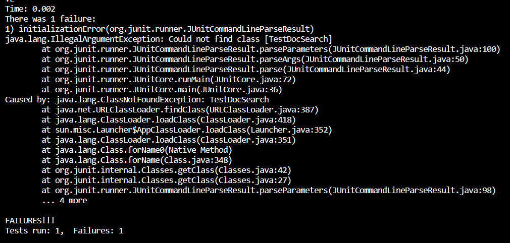

# Part 1 from Vim
*Add a new line to print before File[] paths = f.listfiles()*

Using the shortest sequence of commands:
```
/toString
^ //To reach File[] path, around 3 key presses
shift a
enter //to create blank space above
System.out.println(f.toString() + "is a directory");
esc
:x
```
Effectively, this took me around 30 seconds to do.

 While I'm sure there are better shortcuts, such as /f.listFiles(), I felt the most comfortable and fastest with this method.

To double check my code stayed, I re-typed vim DocSearchServer.java.


# Part 2
*Second, start already logged into a ssh session. Then, make the edit for the task you chose in Vim, then exit Vim and run bash test.sh.*

This method was the most comfortable and fastest for me, effectively taking around 40 minute to do. The first method took too long, around 1 minute and 20 seconds. 

I was struggling especially with writing the whole scp code, it was faster to already be logged into ssh and making the edits inside the code. 

*However,* the task was simple in concept where it wouldn't have taken me longer than 2 minutes to do. For more complicated tasks, I would use the first scp method which allows me a wider range of editing code than relying on Vim commands solely. 

*bash test run*
